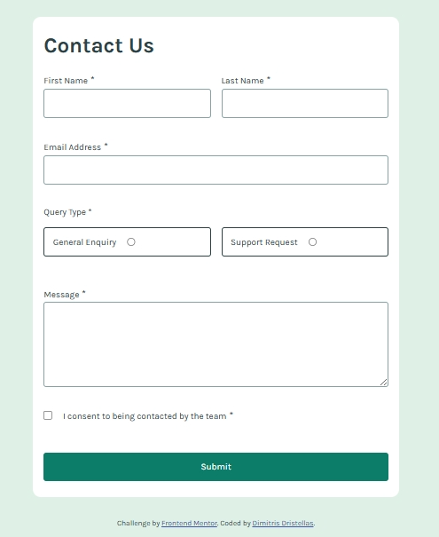

# Frontend Mentor - Contact form solution

This is a solution to the [Contact form challenge on Frontend Mentor](https://www.frontendmentor.io/challenges/contact-form--G-hYlqKJj). Frontend Mentor challenges help you improve your coding skills by building realistic projects. 

## Table of contents

- [Overview](#overview)
  - [The challenge](#the-challenge)
  - [Screenshot](#screenshot)
  - [Links](#links)
- [My process](#my-process)
  - [Built with](#built-with)
  - [What I learned](#what-i-learned)

- [Author](#author)

## Overview

### The challenge

Users should be able to:

- Complete the form and see a success toast message upon successful submission
- Receive form validation messages if:
  - A required field has been missed
  - The email address is not formatted correctly
- Complete the form only using their keyboard
- Have inputs, error messages, and the success message announced on their screen reader
- View the optimal layout for the interface depending on their device's screen size
- See hover and focus states for all interactive elements on the page

### Screenshot



### Links

- Solution URL: [Add solution URL here](https://github.com/dimitrisdr/contact-form-main.git)
- LiveSite URL: [Add solution URL here](https://dimitrisdr.github.io/contact-form-main/)

## My process

### Built with

- Semantic HTML5 markup
- CSS custom properties
- Flexbox
- CSS Grid
- Mobile-first workflow


### What I learned


```html
  <input name="name" id="name" type="text" class="text-input" autocomplete="given-name" aria-describedby="error-msg-name">
  <span id="error-msg-name" class="error-msg">This field is required</span>
```
```css
#email:not(:focus):invalid {
    border: 1px solid var(--Red);
}

#email:not(:focus):invalid ~ .error-msg {
    transform: scale(1);
}
```

```js
function handleSubmit(e) {
    e.preventDefault()
    let formIsValid = false
    let data = Object.fromEntries(new FormData(form))
    fillExtraDataIfNececary(data, criticalFormInputs)
    let emptyValues = Object.keys(data).filter(key =>  validateEntriesObj[key](data[key]) )
    console.log(emptyValues)
    formIsValid = (emptyValues.length === 0) ? true : false;
    if (formIsValid) {
        alertMsg.classList.remove('hidden-msg')
        alertMsg.setAttribute('aria-hidden', false)
        fieldInputs.forEach(inpt => {
            if (inpt.matches('.text-input')){
                inpt.value = ''
            }else {
                inpt.checked = false
            }
        })
        setTimeout(()=>{alertMsg.classList.add('hidden-msg')},2000)
    }else {
        let firstInvalid = Array.from(fieldInputs).filter(e => e.name === emptyValues[0])[0].getBoundingClientRect().y
        window.scroll({top:firstInvalid, behavior:'smooth'})
    }

    formItems.forEach(item => {item.classList.toggle('error', emptyValues.includes(item.dataset.related))})

}
```

## Author

- Frontend Mentor - [@dimitrisdr](https://www.frontendmentor.io/profile/dimtirisdr)